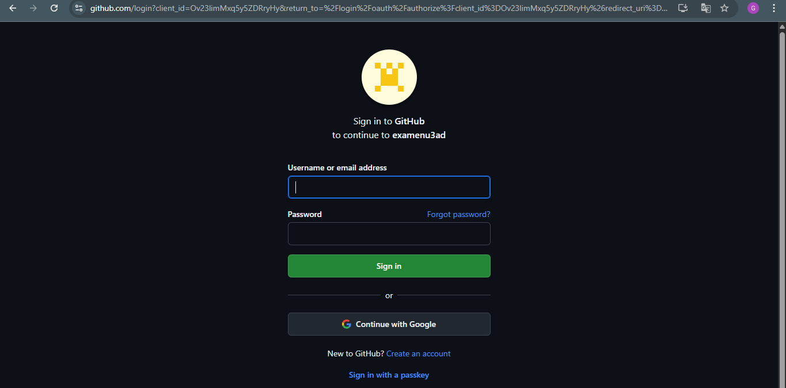
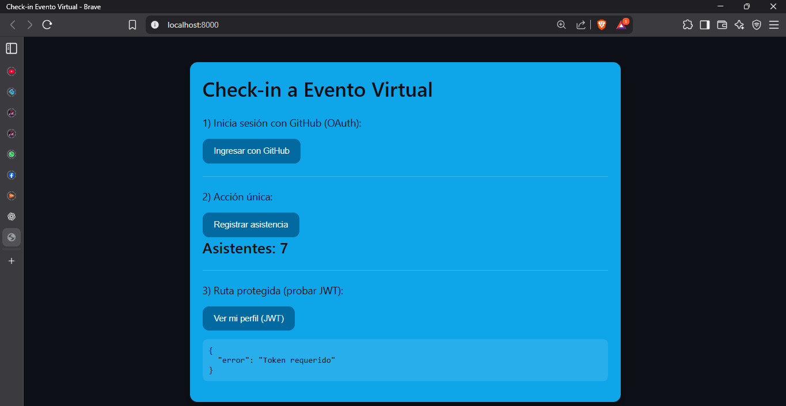

# Check-in a Evento Virtual

Aplicación web que permite a los usuarios registrarse en un evento virtual iniciando sesión con **GitHub OAuth**, gestionar la sesión mediante **JWT** y actualizar un **contador de asistentes en tiempo real** con **Socket.io**.

---

## Características

- **Autenticación OAuth 2.0** con GitHub.
- **Gestión de sesión** mediante JWT.
- **Ruta protegida** `/api/profile` que muestra datos del usuario autenticado.
- **Contador global** de asistentes actualizado en tiempo real con Socket.io.
- **Despliegue en la nube** para uso público.

---

## Capturas de Pantalla

### Pantalla principal (inicio de sesión y registro de asistencia)

### Nuevo ingreso no tiene JWT

### Ruta protegida con JWT

---

## Instalación y Ejecución Local

### Clonar repositorio

git clone https://github.com/gregoryNa9/ExamenU3AD.git
cd ExamenU3AD
2. Instala dependencias:  
   npm install  

3. Configura variables de entorno:  
   Crea un archivo `.env` en la raíz del proyecto con el siguiente contenido:  

   PORT=8000  
   CLIENT_URL=http://localhost:8000  
   JWT_SECRET=clave_secreta_segura  
   GITHUB_CLIENT_ID=tu_client_id  
   GITHUB_CLIENT_SECRET=tu_client_secret  
   OAUTH_REDIRECT_URI=http://localhost:8000/auth/github/callback  

4. Ejecuta la aplicación:  
   npm start  
   o si tienes **nodemon** instalado:  
   nodemon server.js  

## Variables de Entorno

- PORT: Puerto donde se ejecutará el servidor.  
- CLIENT_URL: URL del cliente (ejemplo: http://localhost:8000).  
- JWT_SECRET: Clave secreta para firmar y verificar JWT.  
- GITHUB_CLIENT_ID: Client ID de tu app en GitHub OAuth.  
- GITHUB_CLIENT_SECRET: Client Secret de tu app en GitHub OAuth.  
- OAUTH_REDIRECT_URI: URL de callback registrada en GitHub OAuth App.

## 🌐 URL en Producción
http://localhost:8000

## 👨‍💻 Autor
Desarrollado por Gregory Chevez Bazan  
Examen con Node.js, Express, OAuth, JWT y Socket.io.  
